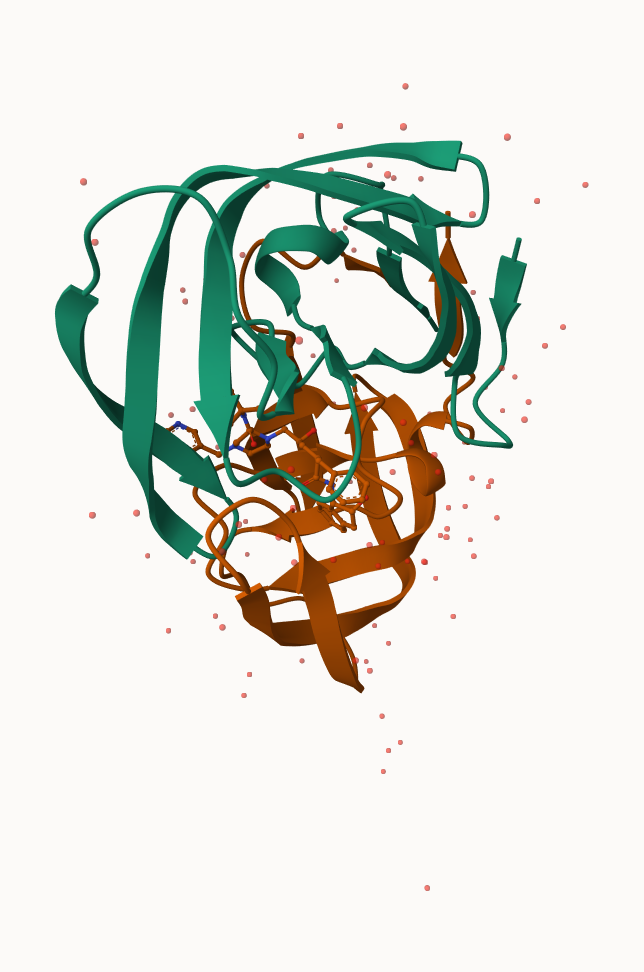
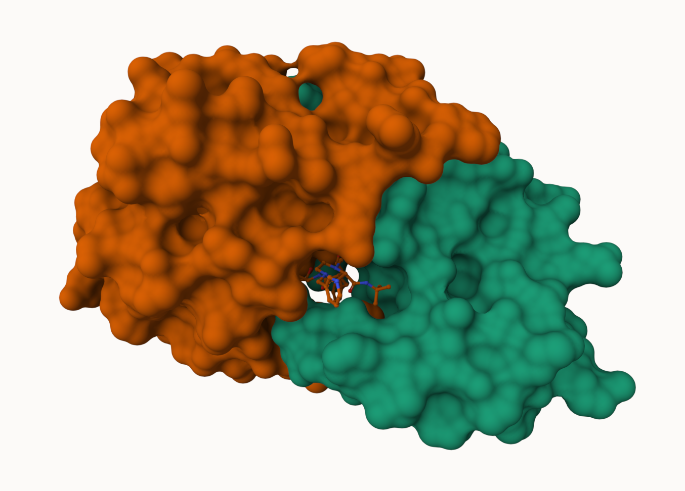
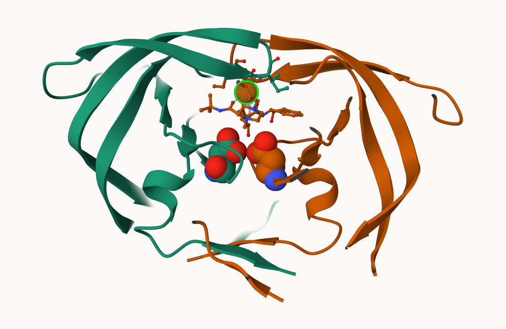

## Background 

The main repository of high-resolution structual data on biomolecules is called the **Protein Data Bank** (PDB).

## PDB Statistics 

What is in the PCB in terms of molcule type and structure determination method?

Read a CSV file of current PDB stats obtained from 
https://www.rcsd.org/stats/summary

```{r}
pdb <- read.csv("Data Export Summary.csv")
pdb
```

> Q1: What percentage of structures in the PDB are solved by X-Ray and Electron Microscopy.

```{r}
pdb$X.ray
```

> Q2: What proportion of structures in the PDB are protein?

```{r}
protein <- 217375 + 14283 + 16277
total <- 217375 + 14283 + 16277 + 5004 + 244 + 22
protein / total
```


We could also use a different import function for this CSV that speaKs American (i.e. deals with commas in numbers in a comma separated value file).


```{r}
library(readr)

pdb <- read_csv("Data Export Summary.csv")
```

```{r}
n.tot <- sum(pdb$Total)

```


This print out above 'pdb$X.ray' is "character" not "numeric". Therefore I can't do math with it. We need to fix this...

```{r}
# We want to get rid or sub out commas:
x <- pdb$X.ray
tmp <- sub(",", "", x)
sum( as.numeric(tmp))
```

We could make a function to do this:

```{r}
rm.comma <- function(x) {
  tmp <- sub(",", "", x)
sum( as.numeric(tmp))
}
```

```{r}
n.xray <- rm.comma(pdb$X.ray)
n.em <- rm.comma(pdb$EM)
n.tot <- rm.comma(pdb$Total)

n.xray/n.tot*100
n.em/n.tot*100
```

> Q How many total protein structures are there in this dataset?

```{r}
pdb$Total[1]
```

The total number of protein sequences in UniPort is 202,556,314.

```{r}
217375/202556314*100
```

> **Key-Point**: We have a very, very samll structural coverage of known proteins (~0.1%). Most structures we know about (~80%) come from one method (X-ray crystalography).

## Visualizing PDb Data with Mol-Star

Main stand alone web version with all features is at https://molstar.org/viewer/.







## Introduction to Bio3D in R

```{r}
pak::pkg_install(c("bioboot/bio3dview",
                   "NGLVieweR",
                   "bioc::msa"))
```

# Getting Started with the Bio 3D package

Bio3D is an R package from CRAN for structural bioinformatics.

There are lots of functions that can work with these 'pdb' objects:

```{r}
library(bio3d)

pdb <- read.pdb("1hsg")
pdb
```


```{r}
library(bio3dview)

view.pdb(pdb)
```

Let's try a custom view

```{r}
view.pdb(pdb, colorScheme = "sse", backgroundColor = "black")
```


> Q. Create a custom view of HIV-Pr highlighting the active site ASP residues ('resno=25'), the two chain (in your choice of colors), and the ligand all on a custom color background?

```{r, eval=FALSE}
active.site <- atom.select(pdb, rsno = 25)

view.pdb(pdb,
         cols = c("red", "blue"),
         highlight = active.site,
         highlight.style = "spacefill",
         backgroundColor = "pink")
```

## Predict the Flexibility of a Given Structure

Let's do a Normal Mode Analysis (NMA) to predict the flexibility of a given 'pdb' object:

```{r}
adk <- read.pdb("6s36")
```

A Quick Structure Summary

```{r}
adk
```

```{r}
m <- nma(adk)
plot(m)
```

```{r, eval=FALSE}
view.nma(m)
```

Write out the results for viewing in Mol-star:

```{r}
mktrj(m, file="nma.pdb")
```

## Compartive Analysis of the Adk Family 

Our first step is to find a sequence for this family. We will use the database ID "1ake_a" here:

```{r}
library(httr)

id <- "1ake_A"

aa<- get.seq(id)
aa
```

Search for related sequences in the database

```{r}
blast <- blast.pdb(aa)
```

```{r}
head(blast$hit.tbl)
```

```{r}
hits <- plot(blast)
```

```{r}
hits$pdb.id
```

```{r}
files <- get.pdb(hits$pdb.id, path="pdbs", split=TRUE, gzip=TRUE)
```

Align and superpose all these ADK stuctures

```{r}
pdbs <- pdbaln(files, fit = TRUE, exefile="msa")
```

```{r}
pdbs
```

Quick Interactive Structural View

```{r, eval=FALSE}
view.pdbs(pdbs)
```

PCA of all this structural data (x, y, and z atom coordinates):

```{r}
pc <- pca(pdbs)
plot(pc)
```

```{r}
plot(pc, 1:2)
```

Interactive View of the PC1 Captured Structural Differences:

```{r, eval=FALSE}
view.pca(pc)
```

```{r}
mktrj(pc, file = "pca.pdb" )
```


